# contextmux

**Write your agent rules once. Compile them to whichever coding agents you use.**

No key, no agent, no cost for this half — it only touches files.

<p align="center">
  
</p>

```bash
npm install -g contextmux     # or: npx contextmux
ctxmux init                   # import what you have, compile it back out
ctxmux advise                 # rules that will not work, or will not be followed
ctxmux sync --explain         # what each agent cannot represent
```

If your team only uses Copilot, `init` notices and only writes Copilot files. Nothing is
generated for tools you do not use.

There is a second half — drive a ticket to a reviewed pull request under gates the agent cannot
ignore. It is optional. Most people start (and many stop) with the compiler above.

→ **[Getting started](#getting-started)** · [How compiling works](#how-the-compiling-works) · [Run a task](#running-a-task) · [Commands](#commands)

---

## Getting started

Requires **Node 22+**. Install, then one command. Nothing spent, fully reversible.

### 1. Install it

```bash
npm install -g contextmux     # or: pnpm add -g contextmux
ctxmux --version
```

Or run it without installing anything:

```bash
npx contextmux --help
```

> Install it **globally**, or as a `devDependency` with `npm install -D contextmux`. Plain
> `npm install contextmux` puts a build-time tool into your application's runtime dependencies,
> where a frontend bundler will try to ship it.

<details>
<summary>From source</summary>

```bash
git clone https://github.com/contextmux/contextmux
cd contextmux && pnpm install && pnpm build
pnpm bundle                   # one portable file, no node_modules

alias ctxmux='node ~/contextmux/packages/action/dist/ctxmux.mjs'
```

The bundle is the same single file the [GitHub Action](#running-tasks-from-a-workflow) runs, so
it needs nothing installed beside it.
</details>

### 2. Point it at a project, on a branch you can throw away

```bash
cd ~/your-project
git checkout -b ctxmux-trial
```

### 3. Run one command

```bash
ctxmux init
```

That is the whole setup. It reads the agent config you already have — `CLAUDE.md`,
`.github/instructions/**`, `.cursor/rules/`, `AGENTS.md` — into `.ctxmux/`, or scaffolds a
starter pack if there is none. It detects your package manager and test commands, asks which
agent should run tasks and where tasks come from, writes that to `.ctxmux/config.json`, and
compiles everything out.

```
Detected
  - package manager: pnpm@10.33.0
  - quality gate: pnpm run typecheck && pnpm run lint

Imported
  - .github/copilot-instructions.md -> .ctxmux/instructions.md
  - .github/instructions/hooks.instructions.md -> .ctxmux/rules/hooks.md
    ...and 14 more

Which agent should run tasks?
  > 1) Claude Code       runs here, needs ANTHROPIC_API_KEY
    2) GitHub Copilot    runs in GitHub, opens its own PR

  choose [1]:

OK  7 file(s) written, 19 compiled. Tasks will run through claude from file.
```

It only asks what it cannot work out. Finding Copilot config already there settles which agents
to generate for, so that question is skipped — and **nothing is generated for tools you do not
use**. Pressing enter takes the answer it already worked out.

Without a terminal — a pipe, a CI runner, `--yes` — it asks nothing and uses what it detected.

### 4. See what it did

```bash
ctxmux doctor            # anything that will fail silently
ctxmux advise            # rules that will not work, or will not be followed
ctxmux sync --explain    # what each agent cannot represent
```

`init` runs `advise` for you and stays quiet unless it found something — which matters most
when it imported config you already had. `init --advise` asks for the report explicitly.

`doctor` checks the plumbing. `advise` reads the rules (no network, no cost, exits zero). Two
commands do cost money and are opt-in — see [Paid advise](#paid-advise-opt-in) below the fold.

### 5. Undo it, or keep it

```bash
git checkout . && git clean -fd      # as if nothing happened
```

That is the whole context compiler, and for most people it is the whole tool. To hand a task to
an agent under gates, carry on to [Running a task](#running-a-task).

---

## How the compiling works

```
        .ctxmux/           ← the one place you write things down
            │
      ctxmux sync
            │
   ┌────────┼─────────┬───────────┐
   ▼        ▼         ▼           ▼
CLAUDE.md  .github/  .cursor/  AGENTS.md    ← generated; never edited by hand
```

Each target wants the same rules in a different file and dialect. Where a tool cannot express
something — Codex cannot activate a skill on demand — contextmux says so. `sync --explain`
prints exactly what each one loses.

Generated files are never edited by hand: contextmux writes a provenance header, notices if you
edit inside it, and refuses to overwrite your work.

```
.ctxmux/
  instructions.md         # global, always-on
  rules/*.md              # path-scoped, by glob
  skills/<name>/SKILL.md  # description-activated
  agents/<name>.md        # named roles
  commands/<name>.md      # reusable prompts
  mcp.json                # MCP servers
```

| Canonical | Claude Code | Copilot | Cursor | Codex |
| --- | --- | --- | --- | --- |
| instructions | `CLAUDE.md` | `.github/copilot-instructions.md` | `.cursor/rules/` | `AGENTS.md` |
| rules | sections | `.github/instructions/*` (`applyTo:`) | `*.mdc` (`globs:`) | nested `AGENTS.md` |
| skills | native | prompt files ⚠ | glob-scoped rules ⚠ | inlined ⚠ |
| agents | native | `.github/agents/*` | reference only ⚠ | inlined ⚠ |
| mcp | `.mcp.json` | repo settings ⚠ | `.cursor/mcp.json` | `~/.codex/config.toml` ⚠ |

⚠ means lossy — `sync --explain` prints what degraded and why. Four vendors are not equivalent.

Hand-edit a generated file and `sync` refuses to overwrite it. Co-owned files (`CLAUDE.md`,
`AGENTS.md`) get a managed block; everything outside is preserved. `check` exits non-zero on
drift so CI catches it.

---

## What you just did, and what is left

| Half | What it needs | What you get |
| --- | --- | --- |
| **The context compiler** *(done)* | nothing. No key, no agent, no cost | one source of rules, compiled to the agents you use |
| **The task runner** | an agent, and a key or a Copilot seat | a ticket driven to a proposed change, under gates |

The second builds on the first and is optional — stopping here is a complete use of the tool.

---

## Running a task

Everything here is reversible. The agent works in a git worktree, never your checkout, and
`--dry-run` spends nothing.

### Planning before you run

`ctxmux run` reads a task that already exists; it does not have to be the one that creates it.
`ctxmux plan` gets a task ready for an agent and stops there — no worktree, no agent budget
spent, nothing touches your checkout, nobody is assigned anything. It does one of two things,
depending on whether what you named already exists:

**Nothing by that name yet** — originate a task from a rough description, on the tracker you ask
for:

```bash
ctxmux plan "add a currency formatting helper" --tracker github
# ...review and edit the issue on github.com, add or correct acceptance criteria...
ctxmux run 42 --tracker github --agent codex --model o3
```

`--agent` here is optional and read-only: it asks that agent to turn a rough sentence into a
fuller description and acceptance criteria (the same ask-only capability `advise` uses to review
`.ctxmux/` without editing it), but nothing it writes is treated as final until you have looked at
it. Skip `--agent` and the description you typed becomes the task body as-is.

**Already exists, and `--agent` names one** — bridge it to a GitHub issue and stop there:

```bash
ctxmux plan PDC-1234 --tracker jira --agent codex --repo owner/name
# opens a GitHub issue mirroring PDC-1234's title, body and labels — assigns nobody
# ...review the mirrored issue, correct anything it got wrong...
ctxmux run <that issue number> --tracker github --agent codex
```

A GitHub issue is the review surface every run reports back to (`--open-pr`, `status`, `trace`),
regardless of which agent ends up doing the work — so bridging applies the same way for a driven
agent like `codex` as for `copilot`, whose coding agent has no other way to receive a task at all;
for Copilot, bridging is not a convenience, it is the only path there is. Naming no agent, or one
where the task is already on GitHub, leaves it alone and just tells you it is ready to `run`.

| Flag | Meaning |
| --- | --- |
| `--tracker <name>` | Where the task is (or will be created): `file` *(default)*, `github` or `jira` (jira also needs `JIRA_PROJECT_KEY`) |
| `--agent <name>` | Draft a new task with `claude`/`codex` (read-only); bridges an existing one to GitHub for any agent |
| `--model <name>` | Model for the drafting agent |
| `--labels <list>` | Comma-separated labels to apply to a newly created task |
| `--title <text>` | Override the title (default: the first line of what you typed) |
| `--repo <owner/repo>` | Repository to bridge into, when bridging |

| Guarantee | What it means |
| --- | --- |
| **Path scope** | Which files this task may touch. Checked against the diff, not the prompt. |
| **Test integrity** | It cannot make the suite pass by deleting or skipping the test. |
| **Quality gate** | Your project's own test, lint and typecheck commands, run on the result. |
| **Readiness** | A task too vague to attempt is refused before an agent is spent on it. |
| **Isolation** | The agent works in a git worktree. Your checkout is never touched. |
| **Escalation** | Refusals, repeated failures and weakened tests go to a person, not round the loop. |

```bash
ctxmux run "add a helper that formats a ratio as a percentage" \
  --dry-run --allow 'src/**'

ctxmux run "add a helper that formats a ratio as a percentage" --allow 'src/**'
```

```bash
ctxmux status          # every run, with a cost per run and a total
ctxmux trace T-1       # the steps the agent took, and any smells in them
```

### Choosing an agent

| Agent | Runs where | Needs | Opens a pull request |
| --- | --- | --- | --- |
| `claude` | your machine, in a worktree | `ANTHROPIC_API_KEY` | with `--open-pr` |
| `copilot` | GitHub's cloud | the coding agent enabled, plus `CTXMUX_REPO` | itself |
| `cursor`, `codex`, `local` | your machine | the vendor's CLI on `PATH` | with `--open-pr` |

```bash
export ANTHROPIC_API_KEY='...'
ctxmux run T-1 --agent claude

export CTXMUX_REPO=owner/name
ctxmux run T-1 --agent copilot
```

> Only the Claude adapter has been run against its real CLI. `cursor`, `codex` and `local` were
> written from documentation; `preflight` says so.

#### Choosing a model

`--model <name>` picks the model for `claude`, `cursor`, `codex` and `local` — it is forwarded
straight to the vendor's own CLI (`claude --model`, `cursor-agent --model`, `codex exec --model`),
so any name that CLI accepts works here:

```bash
ctxmux run T-1 --agent codex --model o3
ctxmux run T-1 --agent cursor --model sonnet-4.5
```

`copilot` is the exception: its coding agent is an assignment (create an issue, assign a bot),
and GitHub's API for that has no model parameter at all — the model is a setting on
github.com (**Settings → Copilot → coding agent**), not something any per-run flag can carry.
Passing `--model` with `--agent copilot` fails fast and points at that settings page, rather than
silently doing nothing.

### Choosing a tracker

| Tracker | Where tasks live | Needs |
| --- | --- | --- |
| `file` *(default)* | `.ctxmux/tasks/*.md` | nothing |
| `github` | GitHub issues | `gh auth login`, or `GITHUB_TOKEN` |
| `jira` | a Jira project | three environment variables |

```bash
export JIRA_URL='https://your-site.atlassian.net'   # site root only
export JIRA_EMAIL='you@example.com'
export JIRA_API_TOKEN='...'

ctxmux run ABC-1234 --tracker jira --dry-run
```

`ctxmux plan --tracker jira` additionally needs `JIRA_PROJECT_KEY` (e.g. `ABC`), since a new
ticket has no key yet for `plan` to infer a project from — every other Jira operation addresses
one that already has a key. `JIRA_ISSUE_TYPE` defaults to `Task`.

### When it stops

| Signal | Meaning |
| --- | --- |
| `reject readiness: no acceptance criteria found` | Add Acceptance criteria / Expected behaviour / Done when / … |
| `reject path-scope: N file(s) changed outside the task's scope` | Widen `--allow`, or leave it — the gate is doing its job. |
| `escalated — needs a human` | `ctxmux status` shows why. |
| `already finished (rejected) and the task is unchanged` | `rm .ctxmux/state/runs/run-<TASK>.json`, or change the task. |

### Paid advise (opt-in)

```bash
ctxmux advise --depth single   # also ask your agent what it thinks of the rules
ctxmux propose                 # ask what rules this repository is missing
```

`propose` prints; `--write` puts anything in `.ctxmux/rules/`, and never replaces a hand-written
rule.

---

## Commands

| Command | What it does |
| --- | --- |
| `ctxmux init` | Set the repository up: import or scaffold, configure, compile |
| `ctxmux import` | Just the import step, without the rest of `init` |
| `ctxmux sync` | Compile to every configured target |
| `ctxmux check` | Verify generated files are current; non-zero exit if not |
| `ctxmux doctor` | Report what will fail silently |
| `ctxmux advise` | Review the rules themselves (free); `--depth` is opt-in and costs |
| `ctxmux propose` | Ask a council of agents what rules this repository should have |
| `ctxmux map` | Query the repository index |
| `ctxmux plan` | Create a task on a tracker and stop — review and edit it before running it |
| `ctxmux run` | Drive a task to a proposed change, under gates |
| `ctxmux status` / `trace` / `event` | Runs, steps, forge webhooks |
| `ctxmux eval` / `learn` / `add` / `handoff` / `state` | Compare, recur, packs, transfer, share state |

Common flags: `--targets claude,cursor`, `--dry-run`, `--force`, `--explain`, `--root <dir>`.

`init` writes `.ctxmux/config.json`. Precedence: **flag → environment → config → default**.
In CI: `ctxmux check --strict`. `sync` writes `.github/copilot-mcp-config.md` for Copilot MCP
settings.

---

## Packages

The CLI is `contextmux`. Libraries include `@contextmux/context`, `@contextmux/repo`,
`@contextmux/mcp-repo`, `@contextmux/core`, `@contextmux/runner-local`, `@contextmux/agent-*`,
`@contextmux/tracker-*`, `@contextmux/forge-github`, and `@contextmux/eval` / `learn` /
`trajectory` / `handoff` / `council`. Every adapter passes the same published contract suite.

## What it accesses, and why

**Runs:** `git`, and the agent CLI you configure; `gh` when no token is set.

**Contacts:** `api.github.com`, and the Jira site you configure. Nothing else. No telemetry.

**Reads** (by name): `ANTHROPIC_API_KEY`; `GITHUB_TOKEN` / `GH_TOKEN`; `JIRA_URL` /
`JIRA_EMAIL` / `JIRA_API_TOKEN` / `JIRA_PROJECT_KEY` / `JIRA_ISSUE_TYPE`; `CTXMUX_REPO` /
`CTXMUX_AGENT` / `CTXMUX_TRACKER`; GitHub Action vars; `CTXMUX_ROOT`; `OLLAMA_HOST` /
`CTXMUX_LOCAL_MODEL`; optional OTEL endpoints; `NO_COLOR` / `TERM` / `CTXMUX_DEBUG`.

**Writes:** `.ctxmux/`, generated agent files, and a git worktree under system temp.

**On the `yaml` alert:** contextmux calls `parse(source)` with a single argument and never
passes a reviver, anchor handler or custom schema.

## Free, and free to run

Three runtime dependencies: `zod` (MIT), `yaml` (ISC), and the MCP SDK (MIT). Apache-2.0, no
hosted service.

## Status

Pre-release. Covered by 1,261 tests.

**Run against the real thing:** Claude Code, Jira, and GitHub → Copilot → local verify.

**Not yet run against the real thing:** Cursor, Codex and local adapters; the read-only
invocation behind `advise --depth` / `propose`. Free `advise` needs no agent. `preflight` says so.

## Releasing

Tag it. `.github/workflows/release.yml` publishes all twenty packages over OIDC.

## Contributing

```bash
pnpm install && pnpm test && pnpm build
```

See [CONTRIBUTING.md](./CONTRIBUTING.md).

## Licence

Apache-2.0
